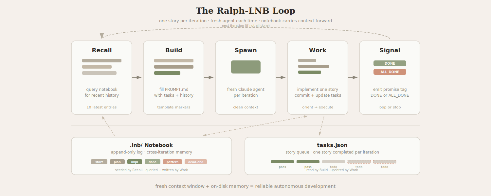

# Ralph-Wiggum-LNB



Autonomous agent loop for code development. Spawns a fresh Claude instance
per iteration. Each iteration completes one story, logs progress to
a [lab-notebook](https://github.com/carbonscott/lab-notebook), and moves on.

Based on the [Ralph Wiggum technique](https://ghuntley.com/ralph/) with
structured notebook logging (queryable history, pattern discovery). See also
[Effective Harnesses for Long-Running Agents](https://www.anthropic.com/engineering/effective-harnesses-for-long-running-agents).

## Prerequisites

Ralph depends on the [`lab-notebook`](https://github.com/carbonscott/lab-notebook)
CLI being on `$PATH` — it's called on every iteration (notebook init,
emit, sql). Install it first:

```bash
# Recommended (isolated install):
uv tool install git+https://github.com/carbonscott/lab-notebook

# Or with pip:
pip install git+https://github.com/carbonscott/lab-notebook
```

Verify with `lab-notebook --help`. Update later with
`uv tool install --force git+https://github.com/carbonscott/lab-notebook`.

## Install

```bash
# Pick any path; snippets below reference $RALPH_REPO so they copy-paste verbatim.
export RALPH_REPO=~/codes/ralph-wiggum-lnb

git clone https://github.com/carbonscott/ralph-wiggum-lnb "$RALPH_REPO"
"$RALPH_REPO/install.sh"
```

Add the `export` line to your `~/.zshrc` or `~/.bashrc` if you want it
to persist across new terminals. The installed `ralph` binary and
`/ralph-lnb` skill don't need it — only snippets in this README and
`cc/RALPH-CC.md` do.

Two install artifacts:

- `~/.local/bin/ralph` → symlink to the headless runner. Put `~/.local/bin`
  on `$PATH` if it isn't already (`install.sh` warns you if not).
- `~/.claude/skills/ralph-lnb/SKILL.md` → the `ralph-lnb` skill. Claude
  Code exposes user-invocable skills as slash commands, so it appears
  as `/ralph-lnb` in chat.

After install, the invocations become:

- **Headless**: `ralph --max-iterations 3`
- **Claude Code chat**: `/ralph-lnb max-iterations 3` (restart any
  running sessions — skills load at session start)

`install.sh` is idempotent. Re-run it after moving or re-cloning the
repo — it rewrites the skill with the new path. Override the bin
location with `RALPH_BIN_DIR=/usr/local/bin ./install.sh`. Undo with
`./uninstall.sh` — if you overrode `RALPH_BIN_DIR` on install, pass
the same value on uninstall so it can find the symlink to remove.

If you prefer not to install, you can still run the scripts by
absolute path: `$RALPH_REPO/cc-headless/ralph.sh` for headless mode,
or `follow $RALPH_REPO/cc/RALPH-CC.md` in a Claude Code session.

## Quick Start

```bash
# In your project directory:
cp "$RALPH_REPO/shared/tasks.json.example" tasks.json
# Edit tasks.json with your stories
```

The runner uses `shared/PROMPT.md` from the installed repo by default.
Copy it locally and pass `--prompt ./PROMPT.md` only if you want to
customize the template. **Upgrading from an older checkout?** A stale
`./PROMPT.md` in your project dir is no longer auto-picked up — delete
it if you never customized it, or pass `--prompt ./PROMPT.md`
explicitly if you did.

The runner auto-initializes `.lnb/` with the coding schema on the first
iteration — no manual `lab-notebook init` needed.

Then pick one runner:

**Headless** (uses `claude -p`):

```bash
ralph --max-iterations 5
```

**Inside a Claude Code session** (uses the `Agent()` subagent tool — no `-p` needed):

Start Claude Code in `acceptEdits` mode, then in the session:

> /ralph-lnb max-iterations 5

(Restart any running Claude Code sessions after install — skills load
at session start.)

`tasks.json` is the entire footprint in your project dir. The prompt
template, shared lib, helper scripts, and notebook schema all stay in
the repo and are invoked or sourced by `ralph` / `/ralph-lnb` (or by
absolute path if you skipped install).

## How It Works

```
tasks.json (what to do)  +  .lnb/ (what happened)  +  PROMPT.md (how to do it)
           │                       │                           │
           └───────────┬───────────┘                           │
                       ▼                                       │
              runner   builds prompt ◄─────────────────────────┘
                     │
              ┌──────┴──────────────────────┐
              │  for each iteration:        │
              │    query notebook → history  │
              │    inject tasks + history    │
              │    spawn fresh agent         │
              │    agent works on 1 story    │
              │    agent logs throughout     │
              │    agent emits promise       │
              │    check DONE / ALL_DONE    │
              └─────────────────────────────┘
```

## Two runners, same loop

Ralph ships two entry points that share the same `PROMPT.md`, `tasks.json`,
`.lnb/`, and `archive/` state:

- **`cc-headless/ralph.sh`** — the original. Runs in a terminal, spawns
  a fresh `claude -p` per iteration. Truly stateless outer loop.
- **`cc/RALPH-CC.md`** — drop-in alternative that runs inside a live
  Claude Code chat session and uses the `Agent()` subagent tool. Use
  when `-p` mode is unavailable or restricted. See `cc/RALPH-CC.md` for
  the full invocation recipe and stop-condition semantics.

Both modes complete one story per iteration, emit `<promise>DONE</promise>`
or `<promise>ALL_DONE</promise>`, and keep state in the same places.

## Layout

The repo splits into three directories so the mode boundary is obvious:

- `cc-headless/` — files specific to the headless `claude -p` runner
- `cc/` — files specific to the in-session Claude Code runner
- `shared/` — prompt template, shared bash helpers, notebook schema, and
  task file example used by both runners

## Files

| File | Purpose |
|------|---------|
| `cc-headless/ralph.sh` | Headless runner — uses `claude -p` |
| `cc/RALPH-CC.md` | Driver doc for the Claude Code session runner |
| `cc/ralph-prep.sh` | Per-iteration bookkeeping + prompt builder; stdout is the filled prompt |
| `shared/ralph-lib.sh` | Shared bash helpers sourced by both runners |
| `shared/PROMPT.md` | Prompt template with `<!-- FILL:xxx -->` markers |
| `shared/tasks.json.example` | Starter task file (copy to your project as `tasks.json`) |
| `shared/coding-dev.yaml` | Lab-notebook schema for code dev workflows |

## Task File Format

JSON with stories and `passes` flags. The rigid structure prevents agents
from accidentally rewriting content — the only sanctioned mutation is
flipping `"passes": false` to `"passes": true`.

```json
{
  "project": "MyApp",
  "branch": "ralph/feature-name",
  "description": "Feature description",
  "stories": [
    {
      "id": "US-001",
      "title": "Story title",
      "acceptanceCriteria": [
        "Criterion 1",
        "Criterion 2",
        "Typecheck passes"
      ],
      "priority": 1,
      "passes": false
    }
  ]
}
```

The agent finds the first story with `"passes": false` (by priority),
implements it, sets `"passes": true`, and emits a promise.

## Notebook Schema

The `coding-dev.yaml` schema provides entry types tailored for coding:

| Type | When to use |
|------|------------|
| `start` | Beginning work on a story |
| `plan` | Implementation approach decided |
| `impl` | Progress during implementation |
| `test` | Test results (pass/fail) |
| `review` | PR review feedback |
| `fix` | Changes from review feedback |
| `pattern` | Reusable codebase pattern discovered |
| `blocker` | Something blocking progress |
| `done` | Story completed |
| `dead-end` | Approach abandoned |

Query patterns from all iterations:
```bash
LAB_NOTEBOOK_DIR=.lnb lab-notebook sql \
  "SELECT content FROM entries WHERE type='pattern' ORDER BY ts"
```

## Headless runner options (ralph)

```
--max-iterations N      Safety cap (default: 10)
--prompt FILE           Custom prompt template (default: repo's shared/PROMPT.md)
--task-file FILE        Task file (default: tasks.json)
--notebook DIR          Notebook directory (default: .lnb)
--context SLUG          Notebook context (default: from branch)
--archive-dir DIR       Archive directory (default: archive/)
```

For the Claude Code session runner, invoke it as `/ralph-lnb
max-iterations N` (with `task-file` and other parameters passed
inline). See `cc/RALPH-CC.md` for the underlying driver doc and
stop-condition semantics.

## Archive

When the `branch` field in `tasks.json` changes between runs, both runners
archive the previous task file and notebook to `archive/<date>-<branch>/`.
